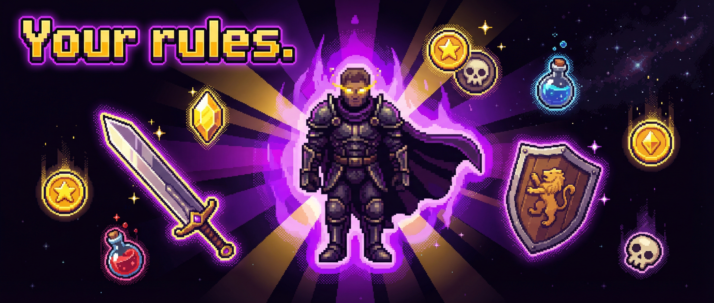
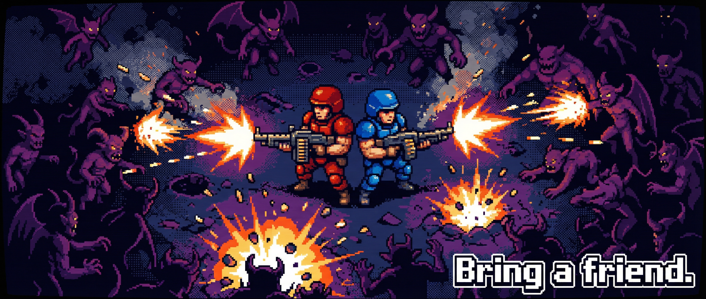

# Bloodshed Mod Toolkit

[](https://store.steampowered.com/app/2747550/Bloodshed/)

[](https://github.com/myso-kr/bloodshed-mod-toolkit/releases)
[](LICENSE)

[](https://builds.bepinex.dev/projects/bepinex_be)


**Languages:** [English](README.md) · [한국어](README.ko.md) · **日本語** · [中文](README.zh-CN.md)

---


ゲームを起動する。カットシーンもない、チュートリアルのポップアップもない。音楽が鳴り響く — あのゴリゴリしたメタルリフ — そして即、戦闘だ。
ピクセルアートのデーモンたちが画面を埋め尽くす。ショットガンが反動を返す。何かが気持ちいい赤い爆発で吹き飛ぶ。12秒で死ぬ。
デスシーンが終わる前にリトライを押す。

*それが Bloodshed だ。* DOOMのDNAをローグライクのレンズで濾過したゲーム — 速く、うるさく、徹底的に容赦ない。

開発者は開発を終了したが、プレイヤーたちは離れなかった。
**Steamレビュー 85% 高評価。** もう一度ミッションを回し、もう一キャラを解放し、もう一つのブロークンシナジーを探す、小さくも粘り強いコミュニティ。

このツールキットはco-opがやりたかったから始まった。次にトウィークが必要になった。次にスポーン数を×4にして無敵をオンにしたらどうなるか確かめたくなった。今はそれを全部やる — F5一発で。

---

## 概要

ゲーム中に **F5** を押してModメニューを開閉します。
メニューは**ゲーム内の言語設定に自動対応**します。

メニューは4つのタブで構成されています:

| タブ | 内容 |
|------|------|
| **CHEATS** | サバイバル/経済/戦闘/移動のトグルとアクションボタン |
| **TWEAKS** | 難易度プリセットと細かなバランス調整スライダー |
| **CO-OP** | Steam P2Pロビー — ホスト/参加/フレンドリスト/XP共有/ミッションゲート |
| **BOTS** | AIボット同伴者（1〜3体） |

---

## 機能



### CHEATS タブ

#### サバイバル

| トグル | 効果 |
|--------|------|
| 無敵モード | プレイヤーがダメージを受けません |
| 全ステータス最大化 | 毎フレームHPを99,999に回復します |
| 無限復活 | 復活回数を常に99に維持します |
| 無限追放 | 追放回数を常に99に維持します |

#### 経済

| トグル | 効果 |
|--------|------|
| ジェム無限 | ジェムが999,999を下回りません |
| スカルコイン無限 | スカルコインが999を下回りません |

#### 戦闘

| トグル | 効果 |
|--------|------|
| 一撃必殺 | 敵へのダメージが×9,999になります |
| クールダウン除去 | スキルのクールダウンスタットを最大化します |
| 速射 | 武器の発射クールダウンをなくします |
| 無反動 | 武器の反動をゼロにします |
| 完璧な照準 | 弾の拡散なし・照準精度の劣化なし |
| リロードなし | 弾薬が消費されず、リロードがキャンセルされます |

#### 移動

| トグル | 効果 |
|--------|------|
| 移動速度倍率 | 移動速度の倍率調整（スライダー: ×1.0 – ×20.0） |

#### アクションボタン

| ボタン | 効果 |
|--------|------|
| 強制レベルアップ | 次のレベルアップに必要な経験値を正確に追加します |
| ジェム999,999獲得 | ジェムを999,999即時付与します |
| スカルコイン+999 | スカルコインを999即時付与します |
| HP全回復 | HPを最大まで回復します |
| 全チートOFF | すべてのトグルをオフにします |

#### オーバーレイ位置

ステータスパネルとDPSパネルを**左上**・**中央上**・**右上**に固定、または非表示にできます。

---

### TWEAKS タブ

**プリセット**ボタン一つで難易度を切り替えるか、スライダーで各数値を細かく調整します。

#### プリセット

| プリセット | 概要 |
|-----------|------|
| **Mortal** | 簡単 — プレイヤー強化・敵弱体化・スポーン減少 |
| **Hunter** | デフォルト — すべての値が×1.00（ゲーム標準） |
| **Slayer** | 難しい — 敵が強く、スポーン+50% |
| **Demon** | 非常に難しい — 敵ダメージ×2、HP×2.5、スポーン×2 |
| **Apocalypse** | 極限 — 敵ダメージ×3、HP×4、スポーン×3 |

#### 個別スライダー

| カテゴリ | 項目 | 範囲 |
|---------|------|------|
| プレイヤー | HP倍率 | ×0.10 – ×4.00 |
| プレイヤー | 移動速度倍率 | ×0.50 – ×3.00 |
| 武器 | ダメージ倍率 | ×0.50 – ×3.00 |
| 武器 | 発射速度倍率 | ×0.50 – ×3.00 |
| 武器 | リロード速度倍率 | ×0.50 – ×3.00 |
| 敵 | HP倍率 | ×0.25 – ×5.00 |
| 敵 | 移動速度倍率 | ×0.25 – ×3.00 |
| 敵 | ダメージ倍率 | ×0.25 – ×5.00 |
| スポーン | 数量倍率 | ×0.25 – ×4.00 |

---



### CO-OP タブ

Steamロビーを使った **P2P Co-op** を最大4人でサポートします。
参加する全プレイヤーがModをインストールしている必要があります。

#### プレイ方法

1. **ホスト** — CO-OPタブで **ロビー作成** をクリック。
2. **ゲスト** — ホストからロビーIDを受け取り、Joinフィールドに貼り付けて **参加** をクリック。
   または **Friends** セクションでフレンドリストを更新し、直接参加または招待します。

#### XP共有モード

| モード | 動作 |
|--------|------|
| 独立 | 各プレイヤーが独自にXPを獲得します |
| 複製 | ゲストがホストと同じXPを受け取ります（デフォルト） |
| 分割 | ホストのXPが半分になりゲストに渡されます |

#### ミッションゲート

ホストがミッションに入ると、ゲストはホストの信号を受け取るまでロード画面で待機します。
シーンの独立進入による同期ずれを防ぎます。

---

### BOTS タブ

**AIボット同伴者1〜3体**を召喚します。ボットのレベル・HP・位置がリアルタイムで表示されます。

---

### ホットキー

| キー | 動作 |
|------|------|
| **F5** | Modメニューの開閉 |
| **F6** | HP全回復 |
| **F7** | 強制レベルアップ |

---

## 必要環境

- **Bloodshed** — Steam、Windows 64ビット
- **BepInEx 6.x（IL2CPP ビルド、Windows x64）**
  最新の `BepInEx_win-x64_*.zip` を公式 bleeding-edge ビルドサーバーからダウンロード:
  <https://builds.bepinex.dev/projects/bepinex_be>
  IL2CPP メタデータ v31 に対応した **be.697 以降** のビルドを使用してください。

---

## インストール

### 方法A — ビルド済みリリース（推奨）

1. [Releases](https://github.com/myso-kr/bloodshed-mod-toolkit/releases) から最新の **`BloodshedModToolkit_vX.X.X.zip`** をダウンロード。
2. BepInEx が未インストールの場合:
   - BepInEx の zip を `Bloodshed/` ゲームフォルダに展開します（`BepInEx/` フォルダが作成されます）。
   - ゲームを一度起動してインターロップアセンブリを生成後、終了します。
3. リリース zip を展開します。内部に `BepInEx/plugins/` 構成が含まれています。
   Bloodshed ゲームフォルダにマージしてください。
4. Bloodshed を起動し、**F5** でModメニューを開きます。

### 方法B — DLL を手動で配置

```
Bloodshed/BepInEx/plugins/BloodshedModToolkit.dll
```

上記パスに `BloodshedModToolkit.dll` をコピーしてください。

---

## ソースからビルド

### 前提条件

- .NET 6 SDK
- BepInEx 6.x がインストール済みで、ゲームを少なくとも一度起動済み（インターロップアセンブリ生成のため）

### 手順

```bash
git clone https://github.com/myso-kr/bloodshed-mod-toolkit.git
cd bloodshed-mod-toolkit

# ローカル設定ファイルを作成し、BepInEx パスを設定
cp Directory.Build.props.example Directory.Build.props
# Directory.Build.props 内の BepInExPath を実際のパスに変更

dotnet build -c Release
# 出力: bin/Release/net6.0/BloodshedModToolkit.dll
```

出力された DLL を `BepInEx/plugins/` にコピーしてください。

### CI 設定（GitHub Actions）

| シークレット | 作成方法 |
|------------|---------|
| `GAME_LIBS_B64` | ゲーム初回起動後に `BepInEx/interop/` フォルダを zip 化し base64 エンコード: `[Convert]::ToBase64String([IO.File]::ReadAllBytes("interop.zip"))` |

`GAME_LIBS_B64` がない場合、ビルドステップはスキップされます（スタブビルドのみ — デプロイ不可）。

---

## 技術ノート

| 機能 | フック |
|------|--------|
| 無敵モード | `PlayerStats.TakeDamage(float, GameObject)` Prefix → スキップ |
| ジェム無限 | `PlayerStats.SetMoney(float)` Postfix + `PersistentData.currentMoney` 毎フレーム |
| 移動速度倍率 | `Q3PlayerController.GetPlayerSpeed/ForwardSpeed/StrafeSpeed` Postfix → 倍率適用 |
| 一撃必殺 | `Health.Damage(float, …)` Prefix → 非プレイヤー対象 ×9,999 |
| クールダウン除去 | `ActiveAbilityHandler.ProcessActiveAbilities()` Postfix → タイマー0 |
| リロードなし | `WeaponItem.GetCurrentAmmo` Prefix → 最大値返却 |
| 速射 | `ShotAction.SetCooldownEnd` Postfix → 0 強制 |
| 無反動 | `WeaponItem.GetRecoilTotal` Prefix → 0 返却 |
| 完璧な照準 | `ShotAction.GetSpreadDirection` Prefix → normalized 返却; `AimPrecisionHandler.ReducePrecision` Prefix → スキップ |
| 敵速度トウィーク | `EnemyAbilityController.SetBehaviorWalkable(float)` Postfix → 倍率適用 |
| スポーン数トウィーク | `SpawnProcessor.GetMaxEnemyCount()` Postfix + `SpawnDirector.SpawnEnemies(…)` Prefix → 倍率適用 |
| プレイヤーHPトウィーク | `PlayerStats.RecalculateStats()` Postfix → MaxHp に倍率適用 |

---

## ⚠️ 免責事項

Co-op機能は **Steamで直接招待した友人** とのみ接続します。
無敵・一撃必殺などのチートは、**全参加者が同意したプライベートセッションでのみ** 使用してください。
公開ロビーなど他のプレイヤーに影響する形でチートを使用した場合、ゲームの利用規約に違反する可能性があります。
不正使用による結果について、作者は一切の責任を負いません。

---

## ライセンス

[MIT](LICENSE)

---

> Bloodshedをまだプレイしたことがないなら — まずそれをやろう。

[](https://store.steampowered.com/app/2747550/Bloodshed/)
