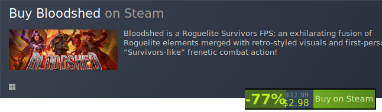
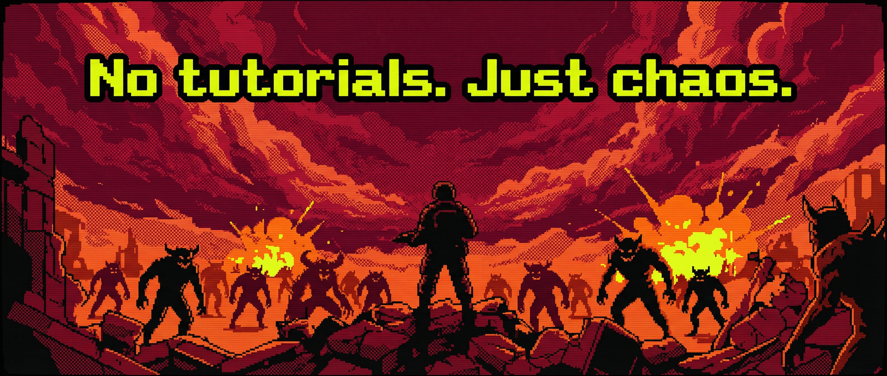

[기능](../features/ko.md) · [설치](../installation/ko.md) · [기술 노트](../technical/ko.md) · [라이선스](../license/ko.md)

**언어:** [English](en.md) · **한국어** · [日本語](ja.md) · [中文](zh-CN.md)

---

# Bloodshed Mod Toolkit

---

게임을 켠다. 컷신도 없고 튜토리얼 팝업도 없다. 음악이 터진다 — 거칠고 묵직한 메탈 리프 — 그리고 바로 전투다.
픽셀 아트 악마들이 화면을 가득 채운다. 산탄총이 반동을 일으킨다. 뭔가가 만족스러운 붉은 폭발로 터진다. 12초 만에 죽는다.
사망 화면이 끝나기도 전에 재시작을 누른다.

*그게 Bloodshed다.* DOOM의 DNA를 로그라이크 렌즈로 걸러낸 게임 — 빠르고, 시끄럽고, 철저하게 가혹하다.

개발사는 정식 업데이트를 마무리했지만, 플레이어들은 떠나지 않았다.
**Steam 긍정 평가 85%.** 미션 하나를 더 돌고, 캐릭터 하나를 더 해금하고, 브로큰 시너지를 하나 더 찾아내는 작고 끈질긴 커뮤니티.

이 툴킷은 코-업이 하고 싶어서 시작됐다. 그다음엔 트윅이 필요했고, 그다음엔 스폰 수를 ×4로 올리고 무적을 켜면 어떻게 되는지 보고 싶었다. 지금은 그걸 전부 한다 — F5 하나로.

---

## 개요

게임 중 **F5** 를 눌러 모드 메뉴를 열고 닫습니다.
메뉴는 **게임 내 언어 설정을 자동으로 반영**합니다.

메뉴는 4개의 탭으로 구성됩니다:

| 탭 | 내용 |
|----|------|
| **CHEATS** | 생존/경제/전투/이동 토글 및 액션 버튼 |
| **TWEAKS** | 난이도 프리셋 및 세부 밸런스 슬라이더 |
| **CO-OP** | Steam P2P 로비 — 호스트/참가/친구 목록/XP 공유/미션 게이트 |
| **BOTS** | AI 봇 동반자 (1–3명) |

---

이 모드가 Bloodshed를 더 즐겁게 만들었다면 — ⭐ 스타 하나가 큰 힘이 됩니다.

> Bloodshed를 아직 플레이해본 적 없다면 — 먼저 그걸 하세요.

